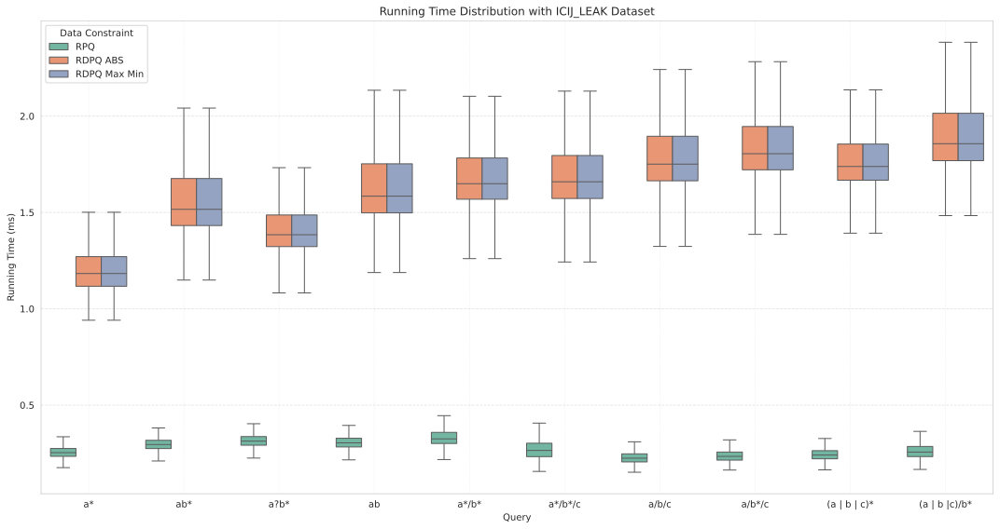
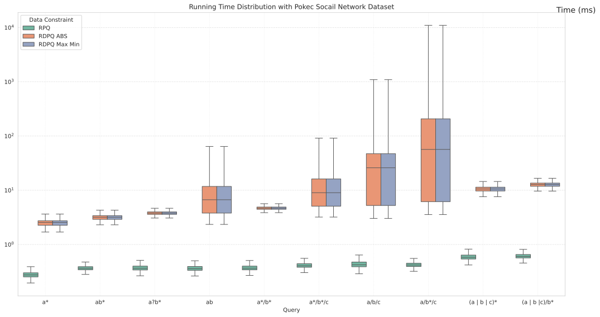
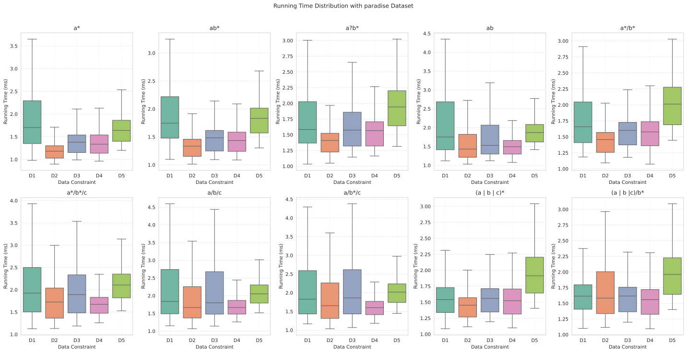
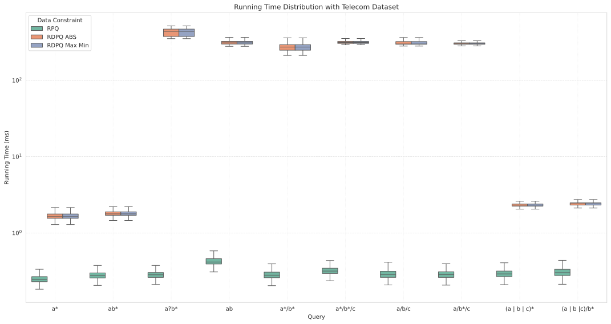
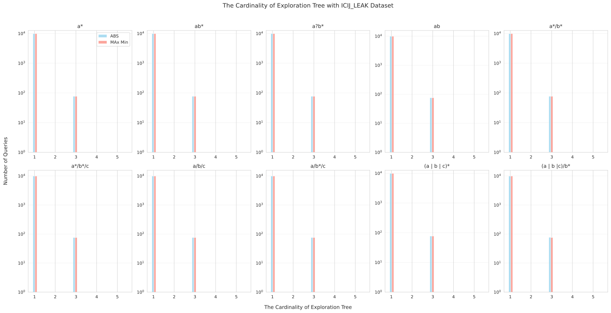
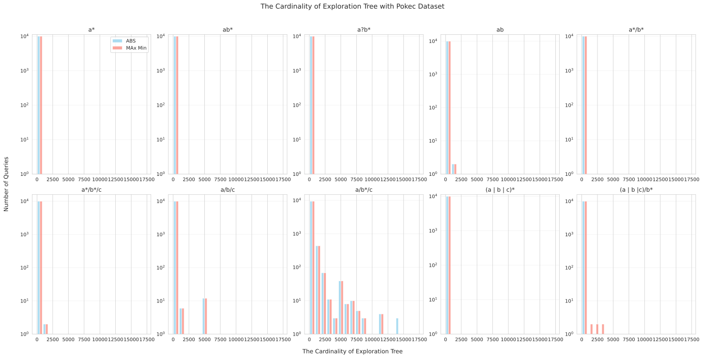
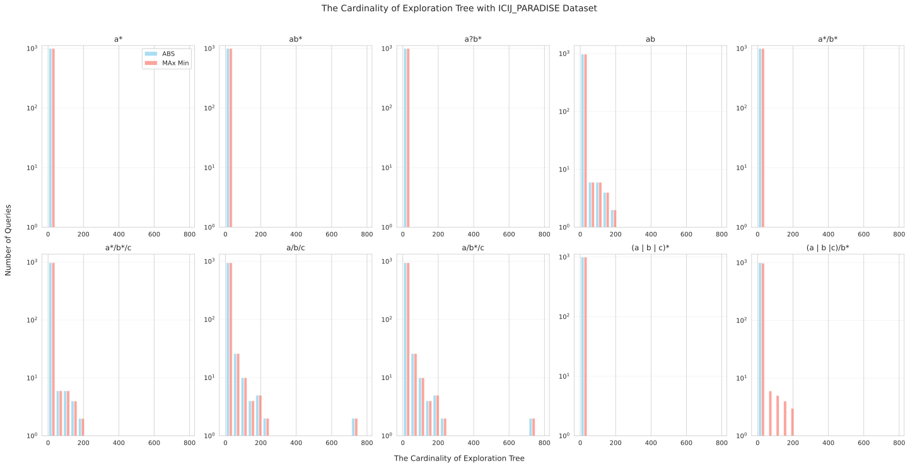
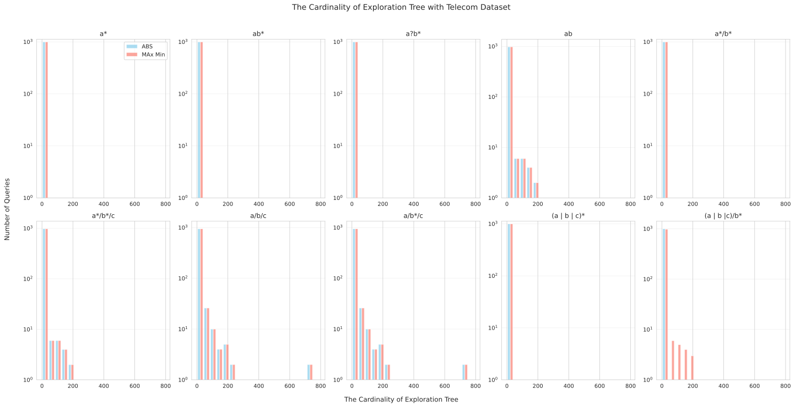

# Technical Report for the First Iteration of Evaluation

## Queries
We have the following regular template:

    1: "a*",
    2: "ab*",
    3: "a?b*",
    4: "ab",
    5: "a*/b*",
    6: "a*/b*/c",
    7: "a/b/c",
    8: "a/b*/c",
    9: "(a | b | c)*",
    10: "(a | b |c)/b*"

And we instantiate two data constraint into the regular expressions

ABS: exists a parameter p, such that 
    
    |?p - attr| < constant

And the equal data constraint is:

    ?p - attr < c and attr - ?p < c 

Max and Min: query the maximum and minimum value of an attribute `attr', i.e.

    ?p >= attr and ?q <= attr

## Experiment Setup
The experiment was run on a ubuntu subsystem on a windows 11 Laptop with i7-13700H Core CPU and 16 GB assigned memories. The following table shows the stat of each dataset. 

| Dataset      | Node Number  | Edge Number   | Queries for Each Template| Queries in Total
| -----------  | -----------  |------|------ | -----|
| ICIJ-Leak    | 1908466  |     3193390   |  10000 | 500000 
| Pokec        |      1632803     |   30622564   | 10000 | 500000
| LDBC10       |  29987850 | 178101408 | 10000 | 500000
| ICIJ-Paradise|   163414 |   364456 | 1000 | 50000
| Telecom      |  170k    | 50M      | 1000  | 50000

## Time Performance:

The following box figures show the stata of running time on each dataset. For Pokec and Telecom dataset, the span of data is relatively large, so I use the logarithm coordinate. 

## Average SMT Formulas Checked Each Step:

It is a constant 3, since we have insert the same formula to each atom of regular expressions. 

Problem: how to take make-sense queries without change the semantics of regular expression. 

For example. if we want to test the difference of $attr$ between two objects less or equal than 5, we need 

    ?p = attr and ?q < attr /( ?p > attr > ?q)* /
     ?p > attr and ?q = attr and ?p - ?q < 5

    /*We omit the labels of objects */

We can not instantiate such formula to regex end with $*$

## Alternative Metric: The Cardinality of the Exploration Tree

The following bar figures present tha stata of exploration tree cardinalities of each regular expression with different data constraint on each data set. The x-axis represent the cardinality of exploration tree, and the y-axis represent the number of queries. I also use logarithm coordinate for the y-axis.

